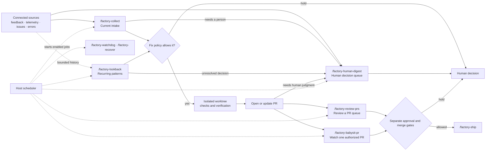

# Experimental software factory

> **Experimental:** Factory skills install agent instructions. They do not add
> integrations, credentials, scheduled jobs, or permission grants. Host support
> and the configuration conventions can change.

Factory is a set of composable skills for turning configured product and
maintenance signals into reviewed software changes. Each action has its own
autonomy policy: fixing an issue does not automatically authorize a reply,
approval, merge, deployment, or issue closure.

## Workflow at a glance

Factory uses the read-capable integrations and scheduler already available in
your agent host. The source names below are examples; there is no fixed Factory
connector catalog.



The diagram shows possible handoffs, not automatic permissions. Every recurring
job must be created and verified in the host scheduler.

## Install

Run the interactive installer and select **Factory** to preselect the group.
You can remove individual skills, then choose clients and install scope:

```sh
npx @agent-native/skills@latest add
```

Every Factory skill is marked experimental in the installer and skills list.

## Skills

| Skill | Use it for |
| --- | --- |
| `/factory`| Choose sources, policies, schedules, worktrees, and host automations. |
| `/factory-collect`| Collect and triage configured feedback, product telemetry, errors, and issues. |
| `/factory-lookback`| Look across a bounded history for recurring symptoms and systemic fixes. |
| `/factory-human-digest`| Aggregate PRs, issues, feedback, errors, and delivery work still waiting for human judgment. |
| `/factory-review-prs`| Review a filtered queue of PRs; apply separate reply, approval, and merge rules. |
| `/factory-babysit-pr`| Follow one explicitly authorized PR, fix in-scope findings, and apply separate publish, reply, approval, merge, and soak rules. |
| `/factory-ship`| Publish and complete delivery work under the project's policy. |
| `/factory-watchdog`| Find stalled, explicitly authorized delivery work and notify only when a concrete next step is due. |
| `/factory-recover`| Resume an interrupted run only when its original authorization and worktree are still valid. |

`/factory-collect` handles current items. `/factory-lookback` compares history
to find patterns the normal item-by-item flow has missed or only fixed
temporarily. `/factory-human-digest` gathers the work held for a person across
those flows. `/factory-review-prs` is a queue sweep, while
`/factory-babysit-pr` follows one PR. `/factory-watchdog` looks for stopped
delivery work and `/factory-recover` handles eligible interrupted runs. Use
`/agent-watchdog` for a general audit of another agent's session or diff; it
does not replace these Factory workflows.

## Human decision digest

Run `/factory-human-digest` to see the work that did not enter an agent-handled
path or still needs human judgment. With no narrower request, it reads all
configured categories for the last 7 days and uses balanced detail. Narrow it
in ordinary language, such as “PRs only, last 30 days, detailed,” “issues only,
this month,” or “everything this week, brief.” A filter cannot expand the
repositories, source scopes, or tools in the project config.

The digest groups related feedback and errors when their evidence points to the
same underlying UX or system problem. It keeps each source link and distinguishes
the count of reports from the number of affected people. It includes PRs waiting
for human review or a merge decision, issues and feedback held for clarification
or policy, new answers that have not been re-triaged, and failed or stalled
delivery work without a safe authorized next step. It does not take actions;
use the owning Factory workflow when a decision leads to a reply, approval,
merge, status change, or other write.

`/factory-collect` may ask one targeted follow-up question when the configured
reply policy allows it. Later collection runs check for answers and re-triage
the original report with the new details under the same fix criteria.
`/factory-lookback` also reads those follow-up threads to see whether the new
information explains a repeated pattern or supports a systemic fix. An answer
does not mark the report fixed or authorize a separate action.

## Configuration at a glance

This example separates frequent intake from a slower retrospective and shows
how to add project-specific prompt guidance to a skill. Replace every scope
and tool name with a connection your host actually exposes.

```yaml
version: 1
timezone: UTC

sources:
  - id: support
    provider: slack
    scope: channel-id
  - id: product-events
    provider: custom
    scope: product-name
    integration: analytics-mcp
    read_tool: query_events
  - id: runtime-errors
    provider: sentry
    scope: organization/project

repositories:
  - id: app
    provider: github
    remote: example/project

workflows:
  collect:
    enabled: true
    schedule: every 4 hours
    sources: [support, product-events, runtime-errors]
    implement:
      mode: criteria
      allow: [verified defects in owned code]
      stop: [unclear product intent, security-sensitive changes]
    reply:
      mode: criteria
      require: [one missing detail blocks triage or verification]
      tone: warm and direct
      guidance: Ask one targeted question, then re-triage when an answer arrives.
  lookback:
    enabled: true
    schedule: monthly
    window: last 30 days
    compare_with: previous 30 days
    sources: [support, product-events, runtime-errors]
    implement:
      mode: manual
  human-digest:
    enabled: true
    schedule: weekly
    window: last 7 days
    repositories: [app]
    sources: [support, product-events, runtime-errors]
    include: [pull-requests, issues, feedback, errors, telemetry]
    granularity: balanced

skill_prompts:
  factory-ship: |
    Keep release summaries concise and link the verified change.
  factory-human-digest: |
    Group repeated UX concerns while keeping every item link available.
```

`skill_prompts` is an open map: each Factory skill reads the entry matching
its name and layers that text onto its normal instructions. Replace or remove a
key to change the project-specific prompt. It cannot override a user's current
request, grant permission, or weaken repository and host safeguards.

## Run a systemic lookback

Use `/factory-collect` for a current sweep. Use `/factory-lookback` when you
want to compare a bounded history across feedback, telemetry, errors, or
delivery records and ask why the same class of issue keeps returning.

For each cluster, connect the original reports to prior dispositions and
verified changes. A useful lookback distinguishes a symptom that reappeared
after a fix from a genuinely new issue that only shares similar wording. Check
representative cases and sibling paths before deciding whether the cause
belongs at a shared boundary.

The output should make the evidence and remaining uncertainty reviewable:

| Include | Why |
| --- | --- |
| Source links, time window, filters, pages, and unavailable sources | Shows what the lookback actually covered. |
| Counts and impact with identity assumptions stated | Separates event volume from affected users or sessions. |
| Prior fixes, shipped claims, and recurrence evidence | Explains why the ordinary flow did not stop the pattern. |
| Confirmed cause, sibling paths, and alternatives still uncertain | Keeps systemic fixes grounded in observed behavior. |
| Proposed or completed fix, regression proof, and independent action gates | Separates implementation from replies, closure, merge, and live verification. |

Missing history, incomplete pagination, or a disconnected source limits the
conclusion. Keep the lookback manual until its queries, schedule, worktree, and
fix criteria have been verified in the host.

## Configure

Run `/factory` in the project where the workflows should operate. It reads the
project's `.agent-factory/config.yaml`, shows the read-capable integrations
available in the host, and asks about missing scopes and policies. You can use
Slack, GitHub Issues, Jira, Sentry, or another source if the host exposes a
read-capable connector or MCP/API tool for it. Add your own source by describing
that tool, its query arguments, filters, and pagination in the config; the
Factory skills cannot connect a provider that the host does not expose.

The [configuration reference](factory-configuration.md) contains a starter config and
describes every documented property, policy, custom-source field, and host
limitation.

The setup flow is:

1. **Choose sources and scope.** Name the connected tool and exact channel,
   repository, project, metric, or other boundary.
2. **Set action policies separately.** Choose when the agent may fix, reply,
   close, review, approve, publish, merge, deploy, recover, or notify.
3. **Add optional skill prompts.** Write a project-specific string for each
   Factory skill that needs extra guidance.
4. **Choose schedules and isolation.** Use host-supported schedules and a clean,
   automation-owned worktree for code-changing jobs.
5. **Create and verify host automations.** A YAML schedule is only a request;
   `/factory` must read the saved job settings back and report anything the host
   could not configure.

The config is an agent-readable convention, not a validated schema. Unknown
fields do not install connectors or create jobs. Provider-specific fields must
be explained clearly and confirmed with the host.

## Start with low autonomy

- Begin with manual runs or read-only source enumeration.
- Confirm source scope, pagination, counts, and unavailable integrations.
- Try one low-risk fix and verify it with the project's checks.
- Review sample replies and notifications before enabling them.
- Enable PR approval, merge, or deployment only with explicit criteria and
  live-state checks. Keep production deployment independent from merge.

Missing, partial, stale, or unreadable evidence is a hold for a person. The
skills never infer permission for one action from another.

## Limits

- Integrations, credentials, scheduler features, and worktree support come from
  the agent host and connected tools.
- Config values such as schedules, filters, and policy text may need host- or
  project-specific syntax.
- A configured job can still fail to run. Verify its saved schedule and review
  run history before relying on it.
